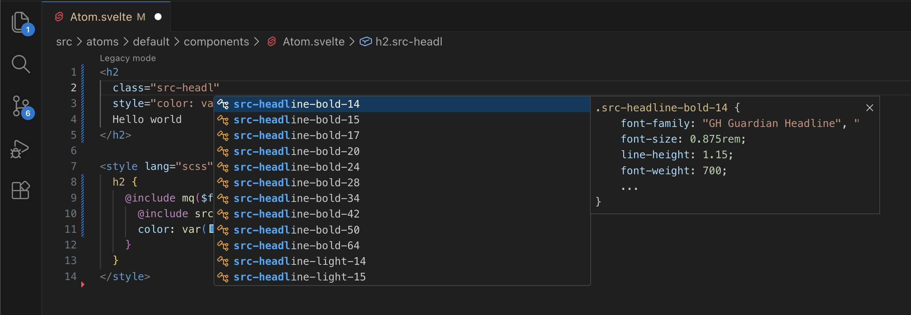
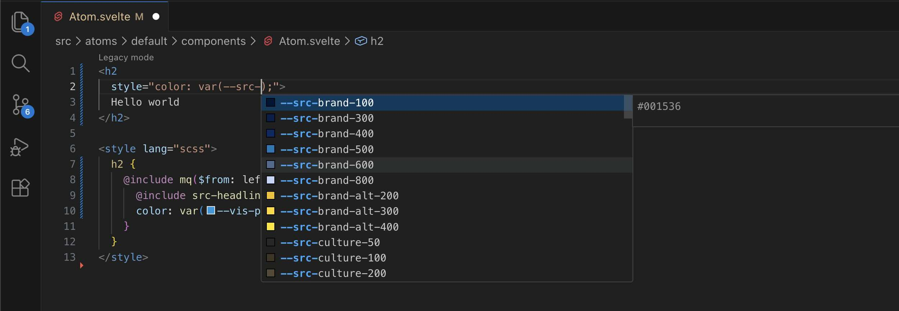
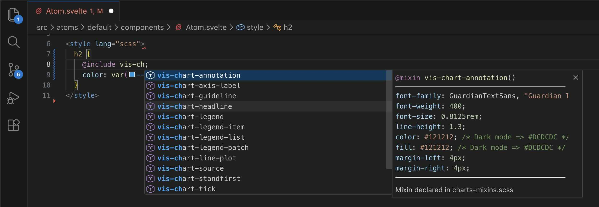
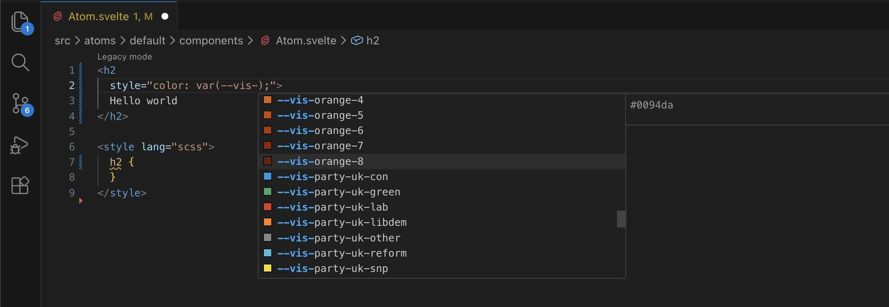

<table>
<tr>
<td>



</td>
<td>



</td>
</tr>
<tr>
<td>



</td>
<td>



</td>
</tr>
</table>

## IDE autocompletion

> [!NOTE]
> If you're working in [interactive-atom-template-2023](https://github.com/guardian/interactive-atom-template-2023) or [the interactives monorepo](https://github.com/guardian/interactives/pull/2885),
> the extensions below should be [recommended to you](https://code.visualstudio.com/docs/configure/extensions/extension-marketplace#_recommended-extensions) in VS Code, and the settings should already be present in the `.vscode` folder in your project root.

To get autocompletion for CSS classes, variables, and SCSS mixins in VS Code, install the following
extensions:

- [CSS Navigation](https://marketplace.visualstudio.com/items?itemName=pucelle.vscode-css-navigation) – enables go-to-definition and autocomplete for CSS classes
- [Some Sass](https://marketplace.visualstudio.com/items?itemName=somewhatstationery.some-sass) – provides SCSS mixin and variable autocompletion

Then add these settings to your `.vscode/settings.json`:

```json
{
  "CSSNavigation.alwaysIncludeGlobPatterns": [
    "node_modules/interactive-style-library/dist/**/*.css"
  ],
  "editor.quickSuggestions": {
    "strings": "on"
  },
  "somesass.scss.completion.mixinStyle": "nobracket"
}
```

- `CSSNavigation.alwaysIncludeGlobPatterns` tells the CSS Navigation extension where to find the
  library's CSS files for class autocompletion
- `editor.quickSuggestions.strings` enables autocompletion inside quoted strings (e.g., class names
  in HTML attributes)
- `somesass.scss.completion.mixinStyle` removes brackets from mixin completions for cleaner output

### SCSS mixin autocompletion

For the Some Sass extension to find the library's SCSS mixins, create a file at
`.vscode/source-sass-refs.scss` with the following content:

```scss
/*
 * This file tells the Some Sass VS Code extension where to find the
 * mixins exported by interactive-style-library. It's only for your editor.
 */

@forward "/node_modules/interactive-style-library/dist/source/breakpoints.scss";
@forward "/node_modules/interactive-style-library/dist/source/mq.scss";
@forward "/node_modules/interactive-style-library/dist/source/typography-mixins.scss";
@forward "/node_modules/interactive-style-library/dist/visuals/charts-mixins.scss";
```

This file isn't used by your build—it just helps the editor discover the available mixins.
