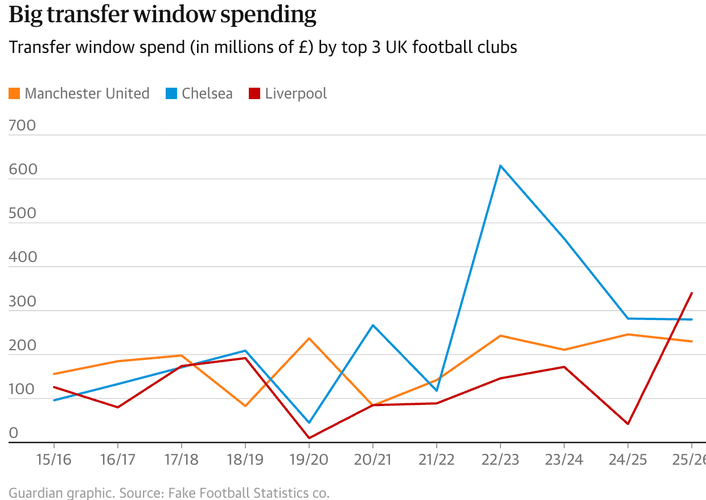
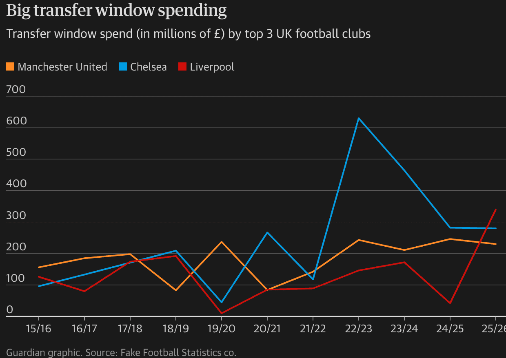

## Simple brand typography

Classes and mixins are available for all of [Source's typography
presets](https://zeroheight.com/2a1e5182b/p/01555f-typography-presets). They're used like so.

```html
<h2 class="src-headline-medium-28">
  Chip wreck! Thousands of chips wash ashore on beach
</h2>

<p class="src-article-17">
  Thousands of bags of chips have washed up on a beach in Sussex.
</p>

<p class="src-article-17-bold">
  The chips washed up near Eastbourne after several shipping containers
  containing "food and packaging" came ashore nearby earlier this week.
</p>
```

### Overriding competing article page styles

The article page's default styles can override these classes, particularly when dealing with
standard elements like `<p>` and `<h2>`.

In these cases, use the typography mixins inside selectors with enough [specificity](https://developer.mozilla.org/en-US/docs/Web/CSS/Guides/Cascade/Specificity)
to beat the article page's default styles.

```svelte
<h2>Chip wreck! Thousands of chips wash ashore on beach</h2>

<p>Thousands of bags of chips have washed up on a beach in Sussex.</p>

<p>
  The chips washed up near Eastbourne after several shipping containers
  containing "food and packaging" came ashore nearby earlier this week.
</p>

<style lang="scss">
   // This `.interactive-atom h2` selector is more specific than the `.src-headline-medium-28`
   // class' selector, so it should beat competing article page styles
  .interactive-atom h2 {
    @include src-headline-medium-28;
  }

   // `interactive-atom` is a standard wrapper class on interactive atoms, but we could
   // use any parent class or element here to create a more specific selector.
  .interactive-atom p {
    @include src-article-17;
  }

  .interactive-atom p:nth-of-type(2) {
    // mixins copy-and-paste the class' styles into this rule.
    // They're named identically to the typography classes.
    @include src-article-bold-17;
  }
</style>
```

## Standard Visuals line chart

This example showcases the chart-building classes and variables from the Visuals design spec.

The colours applied by these classes are fully responsive to light and dark mode — see images of the
rendered charts below.

```svelte
<script>
  import transfers from "./transfers-top-spenders.json"
  import { scalePoint, scaleLinear, line, group } from "d3"
  import {
    plotWidth,
    plotMarginRight,
    plotHeight,
    axisLabelMargin,
    axisTickHeight,
    plotMarginLeft,
  } from "interactive-style-library/visuals/charts"

  const margin = { right: plotMarginRight.desktop, left: plotMarginLeft.desktop, top: 15, bottom: 20, y: 15 + 20 }

  const seasons = [...new Set(transfers.map((d) => d.season))]
  const teams = [...new Set(transfers.map((d) => d.team))]

  const x = scalePoint().domain(seasons).range([0, plotWidth.desktop])
  const y = scaleLinear().domain([0, 700]).range([plotHeight.desktop, 0])
  const plot = line().x((d) => x(d.season)).y((d) => y(d.spend))
</script>

<figure class="vis-chart">
  <h2 class="vis-chart-headline">Big transfer window spending</h2>
  <p class="vis-chart-standfirst">Transfer window spend (in millions of £) by top 3 UK football clubs</p>

  <ul class="vis-chart-legend vis-chart-legend-list">
    {#each teams as team}
      <div class="vis-chart-legend-item">
        <div data-team={team} class="vis-chart-legend-patch"></div>
        <li>{team}</li>
      </div>
    {/each}
  </ul>

  <svg height="{plotHeight.desktop + margin.y}px" width="100%">
    <!-- Y axis labels and guidelines -->
    {#each y.ticks(6) as tick}
      <g class="tick" transform="translate(0, {margin.top + y(tick)})">
        <line class="vis-chart-guideline" x2="100%" />
        <text class="vis-chart-axis-label" y="-{axisLabelMargin}px">
          {tick}
        </text>
      </g>
    {/each}

    <!-- X axis, ticks and labels -->
    <g transform="translate(0, {plotHeight.desktop + margin.top})">
      <line x2="100%" class="vis-chart-x-axis" />

      {#each x.domain() as tick}
        <g transform="translate({margin.left + x(tick)}, 0)">
          <line class="vis-chart-tick" y2="{axisTickHeight}px" />
          <text class="vis-chart-x-axis-label" y="{axisTickHeight + axisLabelMargin}px">
            {tick}
          </text>
        </g>
      {/each}
    </g>

    <!-- Line plot -->
    <g transform="translate({margin.left}, {margin.top})">
      {#each group(transfers, (d) => d.team) as [team, series]}
        <path class="vis-chart-line-plot" data-team={team} d={plot(series)} />
      {/each}
    </g>
  </svg>

  <p class="vis-chart-source">
    Guardian graphic. Source: Fake Football Statistics co.
  </p>
</figure>

<style lang="scss">
  [data-team="Manchester United"] {
    --team-color: var(--vis-news-orange);
  }
  [data-team="Liverpool"] {
    --team-color: var(--vis-news-red);
  }
  [data-team="Chelsea"] {
    --team-color: var(--vis-news-blue);
  }

  path[data-team] {
    stroke: var(--team-color);
    fill: none;
  }

  .vis-chart-legend-patch[data-team] {
    background-color: var(--team-color);
  }
</style>
```

### Preview

<table>
<tr>
<td>

</td>
<td>

</td>
</tr>
</table>

### Notes

Note that a figure element with class `vis-chart` wraps the chart. Chart styles are defined using paired selectors such as `.vis-chart-headline, .vis-chart .vis-chart-headline`.

This allows you to apply the base styles with `.vis-chart-headline`, while the scoped `.vis-chart .vis-chart-headline` selector provides extra specificity when you need to override competing styles without resorting to !important.
